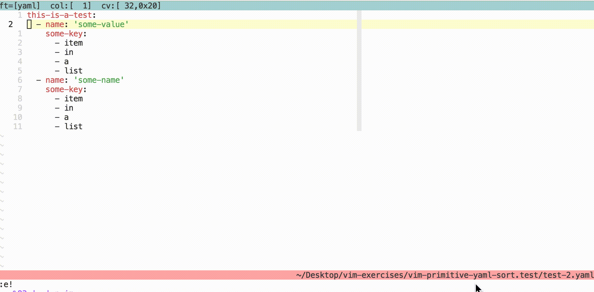

# Primitive yaml sort

Can be used to sort a yaml array by value.

**Sidenote**: Possible keys are: 'name', 'mail'. If you need different or
additional keys please fork this repository and build your own.

**Sidenote**: This plugin assumes you will select a yaml array on layer 2
(indented once). It also assumes that nothing but the array is visually selected.

